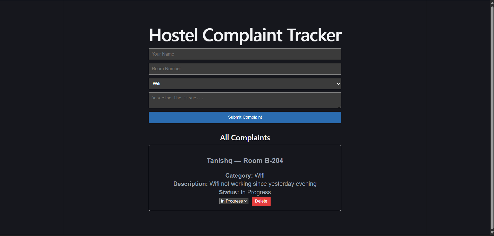

# Hostel Complaint Tracker

A full-stack MERN web application that lets students log hostel-related complaints (electrical, plumbing, wifi, etc.) and track their resolution status in real time.

## Preview

## Features
- Submit complaints with category, room number, and description
- View all submitted complaints in a live-updating list
- Update complaint status (Pending → In Progress → Resolved)
- Delete resolved/invalid complaints
- Data persisted in MongoDB Atlas (cloud database)

## Tech Stack
- **Frontend:** React (Vite), Axios
- **Backend:** Node.js, Express
- **Database:** MongoDB (Mongoose ODM)

## Project Structure
hostel-complaint-tracker/
├── backend/          # Express API + MongoDB models
│   ├── models/
│   ├── routes/
│   └── server.js
└── frontend/         # React app (Vite)
└── src/

## API Endpoints
| Method | Endpoint              | Description              |
|--------|-----------------------|---------------------------|
| GET    | /api/complaints       | Get all complaints        |
| GET    | /api/complaints/:id   | Get a single complaint    |
| POST   | /api/complaints       | Create a new complaint    |
| PUT    | /api/complaints/:id   | Update complaint status   |
| DELETE | /api/complaints/:id   | Delete a complaint        |

## Running Locally

### Backend
cd backend
npm install

create a .env file with MONGO_URI and PORT
npm run dev

### Frontend
cd frontend
npm install
npm run dev

## Future Improvements
- Role-based access (student vs admin)
- Deployment (Render + Vercel)
- Image upload for complaint evidence

## Author
Tanishq